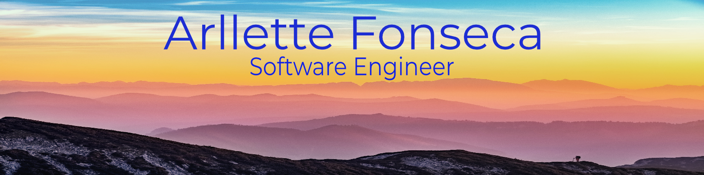
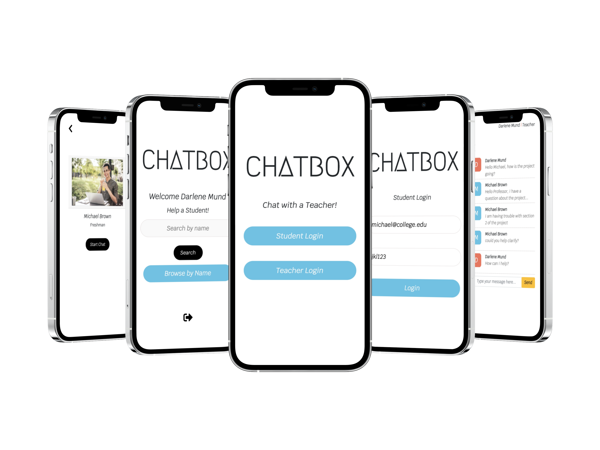
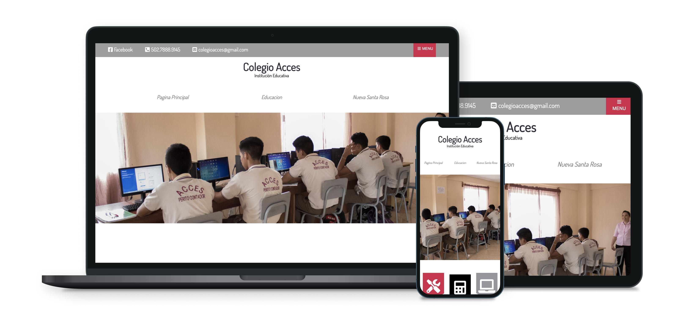
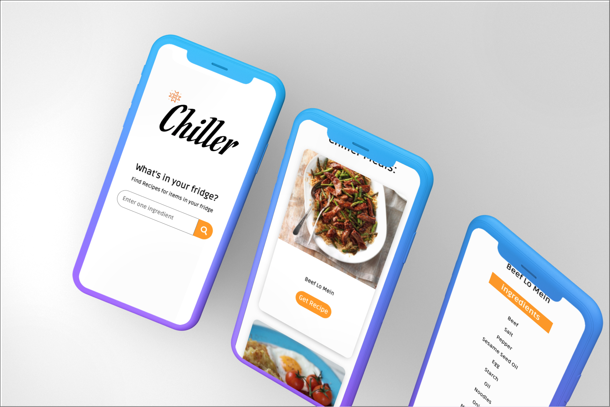

### Hi there 👋, my name is Arllette Fonseca
I am a technology lover who started working on websites as a hobby. I have a background in engineering and customer facing experience. I am a problem solver and a challenge seeker, mixing those two with my hobby has brought me down the web development path. Today, my web development hobby has become my life and I enjoy working on meaningful projects on a daily basis.
### Applications Developed

Live Preview: [Chatbox Application](https://student-teacher-chat.herokuapp.com/)

 A full-stack chat application for students and teachers to communicate with during school hours. Created using JavaScript, React, Socket.io, PostgreSQL, Express, Node.js.

Live Preview: [Colegio Acces Website](https://www.colegioacces.com/)

A technical school website providing students information about the school. Created using HTML, CSS, and JavaScript.

Live Preview: [Chiller Recipe App](https://chiller-recipe-application.netlify.app/)

A recipe application given you instructions for meals based on ingredients in your fridge. Created using HTML, CSS, JavaScript, Ajax and TheMealDB Api.

### Some technologies I enjoy working with:

### 📫 How to reach me:
arllette.fonseca@gmail.com

### Links
LinkedIn Profile: [LinkedIn](https://www.linkedin.com/in/arllette-fonseca-964b5220a/)

My resume: [View](./afonsecaResume.png)

### My GitHub Stats

